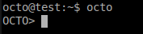

====================
Introduction
====================

.. contents::
   :depth: 3

This manual documents the YottaDB Database Management System and the language Octo. 

The YottaDB Database Management System is a SQL access layer built on top of the not-only-SQL database YottaDB. It aims to provide SQL 92 compliance and exceptional performance.

--------------------
Launching Octo
--------------------

Firstly, make sure YottaDB is correctly `downloaded and installed <https://yottadb.com/product/get-started/>`_.

The SQL engine looks for the environment variable ydb_dist. 

ydb_dist specifies the path to the directory containing the YottaDB system distribution. Either use the ydb script or source ydb_env_set to define ydb_dist. Correct operation of YottaDB executable programs requires ydb_dist to be set correctly.

i.e.

.. parsed-literal::
   source /usr/local/lib/yottadb/r122/ydb_env_set

Obtain Octo from our `repository on GitLab <https://gitlab.com/YottaDB/Octo/YDBDBMS>`_.

.. parsed-literal::
   wget https://gitlab.com/YottaDB/Octo/YDBDBMS/-/archive/master/YDBDBMS-master.tar.gz

Uncompress the file and move to the directory.

.. parsed-literal::
   tar -xzf YDBDBMS*.tar.gz
   cd YDBDBMS-master/

Compile Octo using the following steps:

.. parsed-literal::
   mkdir build
   cd build
   cmake ..
   make
   make test

Launch Octo (without options) with the following command:

.. parsed-literal::
   octo

+++++++++++++++++++
Launching Options
+++++++++++++++++++

Octo has a few options that can be specified when it is launched.

~~~~~~~~~
Verbose
~~~~~~~~~

The verbose option specifies the amount of additional information that is provided to the user when commands are run in Octo.

.. parsed-literal::
   --verbose={number}

or equivalently,

.. parsed-literal::
   -v{v{v}}

The number given to the option corresponds to the following levels:

+-----------------+------------------------+---------------------------------------------+
| Number          | Level                  | Information                                 |
+=================+========================+=============================================+
| 0               | FATAL                  | Informaton about fatal errors               |
+-----------------+------------------------+---------------------------------------------+
| 1               | ERROR                  | Information about all errors                |
+-----------------+------------------------+---------------------------------------------+
| 2               | WARNING                | Includes warnings                           |
+-----------------+------------------------+---------------------------------------------+
| 3               | DEBUG                  | Includes information useful for debugging   |
+-----------------+------------------------+---------------------------------------------+
| 4               | INFO                   | Additional information useful to log        |
+-----------------+------------------------+---------------------------------------------+
| 5               | TRACE                  | Information logged steppping through actions|
+-----------------+------------------------+---------------------------------------------+

When a number level is specified, the verbose output contains all information corresponding to that level as well as the previous levels.

The default verbose level is set to 2 (WARNING).

A single -v in the command line puts the verbose level at 3, -vv puts the level at 4, and -vvv puts the level at 5.

Example:

.. parsed-literal::
   octo --verbose=4

~~~~~~~~
Dry-run
~~~~~~~~

The dry-run option runs the parser, and performs checks and verifications on data types and syntax, but does not execute the SQL statements i.e the database is not altered when Octo is run with the --dry-run option.

.. parsed-literal::
   --dry-run

or equivalently,

.. parsed-literal::
   -d

Example:

.. parsed-literal::
   octo --dry-run

~~~~~~~~~~~
Input-file
~~~~~~~~~~~

The input-file option takes a file as input to Octo, that commands are then read from.

.. parsed-literal::
   --input-file=<path to input file>

or equivalently,

.. parsed-literal::
   -f <input file>

Example:

.. parsed-literal::
   octo --input-file=files/commands.txt

