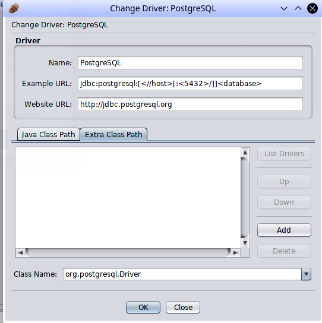
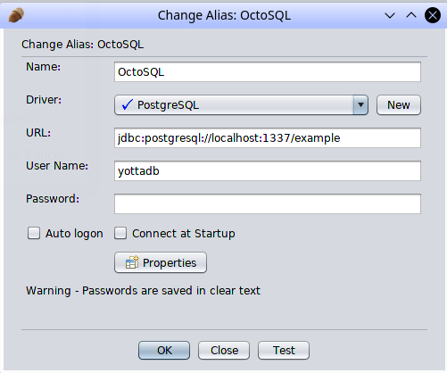
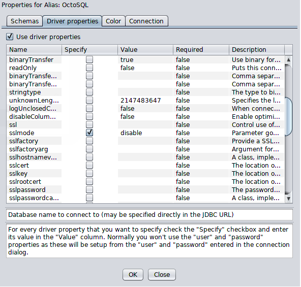
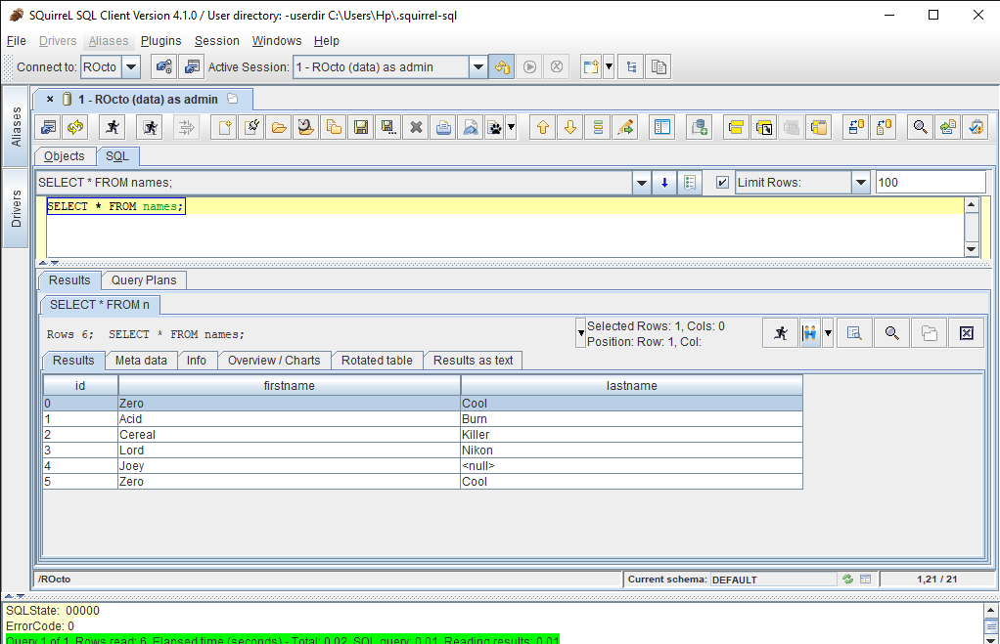

=====================
Rocto
=====================

.. contents::
   :depth: 2

Rocto is the Remote Octo server. It is an implementation of the Postgres server, and receives SQL queries from any clients that can communicate with Postgres over the network. These queries are passed to Octo, which interacts with the database and passes results back through Rocto to the clients.

---------------------------
Connecting to SQuirreLSQL
---------------------------

`SQuirreL SQL <http://squirrel-sql.sourceforge.net/>`_ is an open-source Java SQL Client program for any JDBC compliant database.

**To connect Rocto to SQuirreL SQL**:

* Add a PostgreSQL `JAR <https://en.wikipedia.org/wiki/JAR_(file_format)>`_ file as a driver to SQuirreL SQL.

* Configure the PostgreSQL driver to use the provided JAR file. The URL format for PostgreSQL in SQuirreL SQL is :code:`jdbc:postgresql:[<//host>[:<5432>/]]<database>`.

   Click "Add" and put in the path to the JAR file

Put in the path to your JAR file (e.g. :code:`~/user/postgresql-42.2.6-SNAPSHOT.jar`) in the dialog box that pops up after clicking "Add" on the interface above.

* Create an alias for your Rocto server, including the server IP address and port number. These can be configured for Rocto in the `config file <config.html#config-files>`_.
  For example,

  .. code-block:: bash

     jdbc:postgresql://localhost:1337/example

Rocto requires the creation of a user name and password.
Follow the directions given in the `Octo Administration Guide <https://docs.yottadb.com/Octo/admin.html>`_ to add a new user.

Use the user name and password created in the previous step with the newly created connection alias.

* Rocto does not currently support SSL, so make sure to turn SSL off in the Properties menu when configuring an alias. (Click on Properties and then disable :code:`sslmode`.)

* Connect to Rocto: Execute rocto in your terminal and press the "Connect" button in SQuirreL SQL. Now you can execute SQL queries.

For example:

Suppose there is a table "names" with records in it:

.. code-block:: SQL

   CREATE TABLE names (id INTEGER PRIMARY KEY, firstName VARCHAR, lastName VARCHAR);

A simple query in SQuirreL SQL could be:

.. code-block:: SQL

   SELECT * FROM names;

   Result after the query

----------------------------
Command Line Options
----------------------------

 .. note::

    Mandatory arguments for long options are also mandatory for short options.

#. **-a,  \\-\\-allowschemachanges**

     .. note::

	The :code:`-a/--allowschemachanges` option is off by default and must be explicitly enabled since normal users will not need to change the schema. When using this option, implement security measures appropriate to the environment, e.g. network controls to restrict access to the listening TCP port to a specific host or subnet.

    Allows Rocto to make changes to the schema (CREATE TABLE and DROP TABLE).

#. **-c,  \\-\\-config-file=<filepath>**

     .. note::

	Octo looks for configuration files in default locations, e.g. :code:`$ydb_dist/plugin/octo/octo.conf`. If a configuration file is specified on the command line, this will override any configuration specified in files from the default locations.

    Use specified configuration file instead of the default.

#. **-h,  \\-\\-help**

    Display the help message and exit.

#. **-p,  \\-\\-port=<number>**

    Listen on the specified port.

#. **-v,  \\-\\-verbose=<number>**

    Specify amount of information to output when running commands specifying a numeric value from 0-5 or adding additional 'v' characters.

#. **-r,  \\-\\-version**

    Display version information and exit.

#. **-r,  \\-\\-release**

    Display release information and exit.

